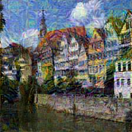
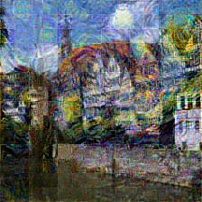
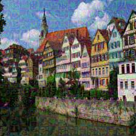

# Vision Transformer-based Style Transfer
In this repo, I provide a way of using multi-head attention layers in ViT to do the style transfer task.

I was inspired by the fact that the visualization of the filters in multi-head attention layers share a same pattern to the CNN filters. More information can be checked in [Exploring Explainability for Vision Transformers](https://jacobgil.github.io/deeplearning/vision-transformer-explainability)

Note that this repo is just a primitive edition which uses the original Vision Transformer. One can also use more advanced architecture of ViT (like Swin-Transformer).

Here, I show some results of the repo. Although the results is not that entertaining, this method may demonstrate that a pretrained ViT can also be used in style transfer task for the perceptual ability of the multi-head attention layers.

  
