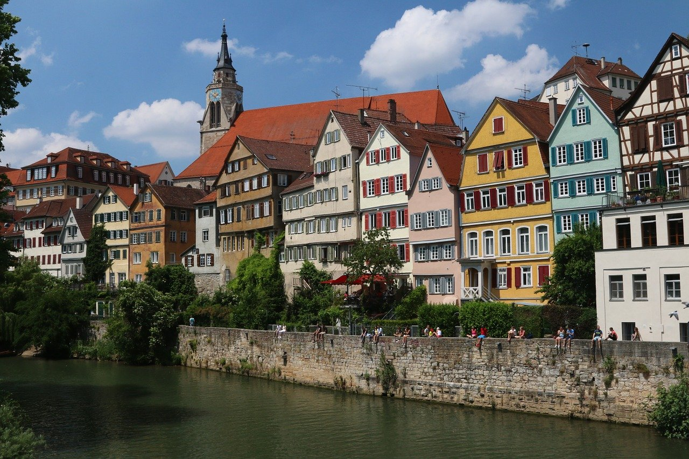

# Vision Transformer (ViT) Style Transfer

A PyTorch implementation of Neural Style Transfer using **Vision Transformers (ViT)**. 

Unlike traditional methods that rely on Convolutional Neural Networks (e.g., VGG19), this project explores the perceptual capabilities of **Multi-Head Self-Attention (MSA)** mechanisms. It demonstrates that pretrained ViTs can effectively capture both artistic style and semantic content for high-quality image synthesis.

## 🖼️ Gallery

| Content Image | Style Image | Stylized Result
| :---: | :---: | :---: |
|  |  | 

## 🚀 Key Features

* **ViT-based Feature Extraction**: Leverages a pretrained `ViT-B/16` (ImageNet) to extract deep features.
* **Patch-wise Gram Matrix**: Calculates style loss based on the correlation between spatial patch tokens, **explicitly excluding the `[CLS]` token** to avoid semantic contamination.
* **Artifact Suppression**: Implements **Total Variation (TV) Loss** to mitigate the checkerboard artifacts (grid patterns) inherent to ViT's 16x16 patch division.
* **Optimization**: Uses the **LBFGS** optimizer for faster convergence and smoother, noise-free image generation compared to standard Adam optimization.

## 🛠️ Installation

This project is built with PyTorch 2.9.1. It is recommended to use Conda for environment management.

1. **Clone the repository**
```bash
git clone https://github.com/Xzzit/ViT-style-transfer.git
cd ViT-style-transfer
```

2. **Create and activate a Conda environment**
```bash
conda env create -f environment.yml
conda activate vit-st
```

## 💻 Usage
```bash
python stylize.py
```